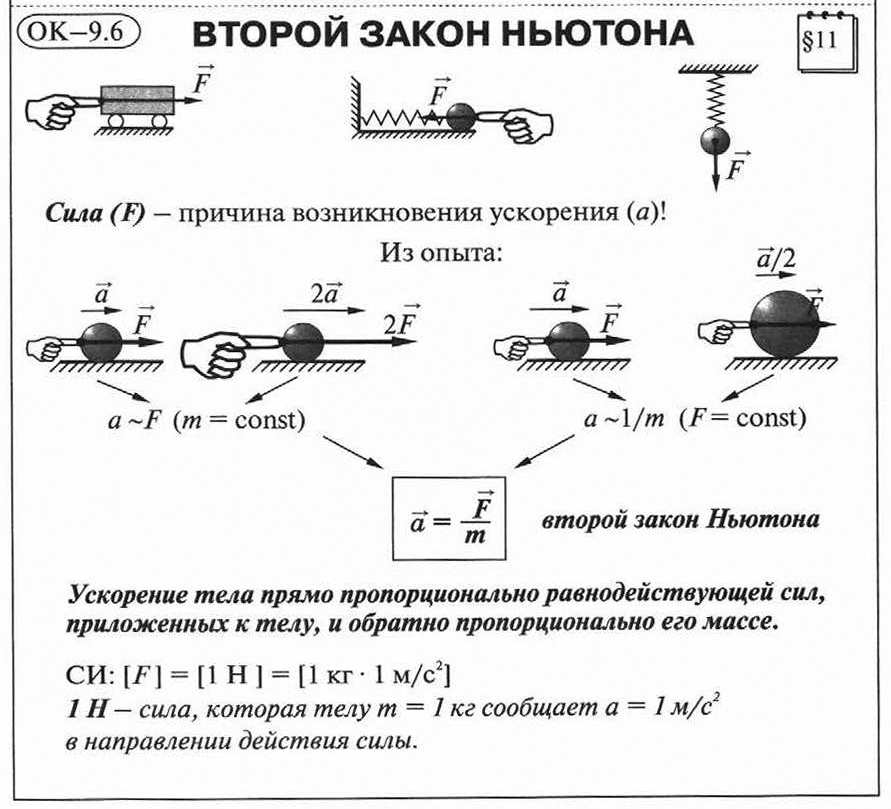

# Физика

## Второй закон ньютона 

**Второй закон Ньютона** — дифференциальный закон механического движения, описывающий зависимость ускорения тела от равнодействующей всех приложенных к телу сил и массы тела. Один из трёх законов Ньютона. Основной закон динамики.

Объектом, о котором идёт речь во втором законе Ньютона, является материальная точка, обладающая неотъемлемым свойством — инерцией, величина которой характеризуется массой. В классической (ньютоновской) механике масса материальной точки полагается постоянной во времени и не зависящей от каких-либо особенностей её движения и взаимодействия с другими телами

Ишется по формуле:

$$
F=ma